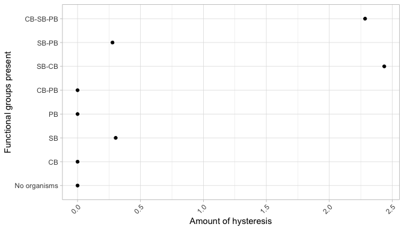

```{r, include = FALSE}
knitr::opts_chunk$set(
  collapse = TRUE,
  comment = "#>"
)
```

```{r setup, include = FALSE}
```

# \textcolor{red}{TODO}
- **\textcolor{red}{update links}**
- **\textcolor{red}{update cross references}**
- **\textcolor{red}{check keywords}**
- **\textcolor{red}{add more references}**
- **\textcolor{red}{expand on Impact and Conclusion section}**
\pagebreak

# Required Metadata
## Current code version
Ancillary data table required for subversion of the codebase.

| **Nr.** | **Code metadata description**                                | **Please fill in this column**                                                 |  
| :-----: | :----------------------------------------------------------- | :----------------------------------------------------------------------------- |  
|   C1    | Current code version                                         | v0.9.0                                                                         |  
|   C2    | Permanent link to code/repository used for this code version | [https://github.com/UZH-PEG/microxanox](https://github.com/UZH-PEG/microxanox) |  
|   C3    | Code Ocean compute capsule                                   |                                                                                |  
|   C4    | Legal Code License                                           | CC BY 4.0                                                                      |  
|   C5    | Code versioning system used                                  | git                                                                            |  
|   C6    | Software code languages, tools, and services used            | [R](https://cran.r-project.org/index.html)                                     |  
|   C7    | Compilation requirements, operating environments             | [R (>= 4.1.0)](https://cran.r-project.org/index.html)                          |  
|         |                                                              | magrittr                                                                       |  
|         |                                                              | tibble                                                                         |  
|         |                                                              | ggplot2                                                                        |  
|         |                                                              | patchwork                                                                      |  
|         |                                                              | grDevices                                                                      |  
|         |                                                              | stats                                                                          |  
|         |                                                              | mgcv                                                                           |  
|         |                                                              | deSolve                                                                        |  
|         |                                                              | dplyr                                                                          |  
|         |                                                              | tidyr                                                                          |  
|         |                                                              | stringr                                                                        |  
|         |                                                              | multidplyr                                                                     |  
|         |                                                              |                                                                                |  
|         |                                                              |                                                                                |  
|         |                                                              |                                                                                |  
|         |                                                              |                                                                                |  
|         |                                                              |                                                                                |  
|   C8    | If available Link to developer documentation/manual          | \textcolor{red}{TO BE ADDED}                                                   |  
|   C9    | Support email for questions                                  | Rainer.Krug@uzh.ch; Rainer@krugs.de                                            |  


# Motivation and significance
Many ecosystems are exposed to gradual changes of environmental variables, to which the responses are not always as gradual as the change of the environmental variable [@REF_NEEDED]. One example where the gradual change of a single environmental variable is causing an abrupt change of the system is the switch from an aerobic to anaerobic system. This system has been investigated by @Bush2017. We wanted to take this investigation one step further, and look at the role an increased biodiversity plays in these dynamics [@REF_NEEDED]. For this purpose, we developed this package.

The microxanox package is a package for simulating a three functional group system (*CB*: cyanobacteria, *PB*: phototrophic sulfur bacteria, and *SB*: sulfate-reducing bacteria) with four chemical substrates (*P*: phosphorus, *O*: oxygen, *SR*: reduced sulfur, *SO*: oxidized sulfur). It includes feedback between biogeochemical processes and is based on [@Bush2017] (See [@Bush2017] for a detailed discussion of the model).

The aims of the `microxanox` package are twofold: firstly, to reproduce the results shown by [@Bush2017], which is accomplished in the [vignette Partial reproduction of Bush et al](LINK NEEDED) and secondly, to take these results one step further, to includes new functionality to address our research question as published in [@REF_NEEDED].

For this, we extended the model and added functionality for:

- Multiple strains (effectively unlimited) per functional group.
- Adding temporally varying oxygen diffusivity.
- Adding random noise in substrate concentrations.
- Including immigration.
- Setting minimum population abundances.

In addition to the model itself, the package includes some functions to analyse the results as well as visualize the results to provide a starting point for customized visualizations based on own requirements.


# Software description
> {>>Describe the software in as much as is necessary to establish a vocabulary needed to explain its impact.<<}

We will discuss the general structure and functionality of the package here without going into to much detail. A more detailed discussion can be found in the [User Guide](LINK_NEEDED).

The model by @Bush2017 is based on ODEs for the rates of change which are specified in the function `bushplus_dynamic_model()`. This augmented version of the model published in [@Bush2017] can handle multiple strains within each of the three functional groups, temporal variation in oxygen diffusivity, and events.

The package is not intended to provide a modelling framework which can be adjusted easily to all needs, but primarily a tool to implement the model used by [@Bush2017] and to extend it to our needs [@REF_NEEDED]. Consequently, any more substantial changes and adaptations are likely to need a change in the source code.

Nevertheless, the source code is structured in modular, so that e.g. the event definition can easily be changed, or other aspects can be adjusted. All values in the parameter object can be changed as needed and the general structure of the code should make it not to difficult to adapt the model to other similar systems.

## Software Architecture
> {>>Give a short overview of the overall software architecture; provide a pictorial component overview or similar (if possible). If necessary provide im- plementation details.<<}

The framework used when writing this package aims at reproducibility of the results (see [@REF_NEEDED] for examples). It builds on the following main considerations:

1. all parameter needed to run a simulation or find a stable state are contained in a single parameter object. This object is created by using the functions `new_..._parameter()`, `new_initial_state()` and `new_strain_parameter()`. Which one of the `new_..._parameter()` functions has to be used when, will be discussed in the section  \@ref(runsim) and in more detail in the [User Guide](LINK_NEEDED).
2. The function call `run_...(parameter)` will run the simulation using the parameter as defined in the object `parameter`.
3. The return value of the `run_...(parameter)` function is identical to the parameter object plus an additional slot named `results` which contains the results of the run
4. As the return value contains all parameter, it is possible to re-run the simulation by simply running `run_...(result)`.

The point that the results object contains all parameter needed to run the simulation, promotes reproducibility and makes incremental changes of individual parameters and re-running the simulations much easier, as can be seen in our research and the RMarkdown [@REF_NEEDED] file used to run and analyse the experiments [@REF_NEEDED].

In the following sections we describe the general usage of the package: running one simulation, finding steady states across an environmental gradient, calculating measures of stability, and visualization.

### Running one simulation

A typical simulation would look as shown in \@ref(fig:runsim_example).

```{R runsim_example, eval = TRUE, echo = FALSE, fig.cap='Typical flow of a simulation. Dark Grey boxes: commands necessary for simulation; Light Grey:Saving of parameter and results; Lightest Grey: Different non specified commands.', fig.align="center", out.width = 350 }
fig <- "./figures/simflow.pdf"

if (!file.exists(fig)){
  library(plantuml)
  puml <- '
    @startuml
    partition "Run Single Simulation" {
      start
      #DarkGrey:\"\"library(microxanox)\"\"\n\"\"parameter <- new_runsim_parameter(...)\"\";
      :Change some parameter
      in the \"\"parameter\"\" object;      
      split
        #LightGrey:\"\"saveRDS(FILE, parameter)\"\";
        detach
      split again
        #DarkGrey:\"\"result <- run_simulation(parameter)\"\";
      end split
      split
        #LightGrey:\"\"saveRDS(FILE, results)\"\";
        detach
      split again
        #DarkGrey:\"\"plot_dynamics(results)\"\";
        :Change some parameter
        in the \"\"result\"\" object;
        #DarkGrey:\"\"result2 <- run_simulation(results)\"\";
      end split
      split
        #LightGrey:\"\"saveRDS(FILE, results2)\"\";
        detach
      split again
        #DarkGrey:\"\"plot_dynamics(results)\"\";
        end
      end split
    }
    @enduml
  '

  plantuml::get_graph(puml, fig)
}

knitr::include_graphics(fig)
```

The individual simulation (`run_simulation()` function) is the working horse in this package. In this function, the ODEs are solved using the function `ode` in the package deSolve package [@Soetaert2010]. The `run_simulation()` function needs only one argument - an object as created by the function `new_runsim_parameter()`. The parameter object contains among other parameter the `strain_parameter` which can be created by the function `new_strain_parameter()`. For a detailed description of the parameter, their meaning and how they are created and can be set and changed please see the User Guide which accompanies the package or is available at [User Guide](@LINK_NEEDED)

After the parameter object has been defined, it can be used in the `run_simulation()` function. The function returns an object which is identical to the parameter object, except of an additional slot containing the results. This design produces a fully reproducible object as it can be used as a parameter object to be fed back into the `run_simulation()` function to run the simulation again from the parameter used to generate the results before.

The function `plot_dynamics()` plots a single simulation run, as returned from the `run_simulation()` function. This function is only provided as a convenience function to provide a way to easily see the results of a simulation run. An example plot resulting from this function is shown in \@ref(fig:plot-dynamics).

```{r plot-dynamics, echo = FALSE,  include=TRUE, fig.cap='Plot of results of a simulation run using the function $plot_dynamics()$. Details can be found in the "User Guide" section "Three strains per functional group".', fig.align="center", out.width = 350 }
knitr::include_graphics("figures/ug_three_strains_dynamics.png")
```


### Finding a Steady State of the model
\textcolor{red}{@Owen: can you please fill in the references to these mathods? Thanks.}

There are two methods for finding steady states implemented in this package. The first runs a separate simulation for each combination of starting conditions and oxygen diffusivity (let us term this the *Replication method*) \textcolor{red}{{>>@Owen - does this approach has a name, and do you have a reference where it has been used or described?<<}. The second runs only two simulations, with step-wise and slowly temporally increasing or decreasing oxygen diffusivities and recorded of state just before change to a new oxygen diffusivity (let us term this the *Temporal method*)\textcolor{red}{{>>@Owen - Has this been used in other publications? I do not have a clue what I could search for to find out...<<}.

#### Replication Method
The replication method is implementad in the function `run_replication_ssfind()` which takes a parameter object as returned by the function `new_replication_ssfind_parameter()` and the number of cores for multithreading the simulation. As the multithreading uses the package function `mclapply()` from the package `parallel` [@RCoreTeam2022], the multthreading only works on Linux and Mac. It is planned to move to `parLapply()` [@RCoreTeam2022] in a future release.

#### Temporal Method
The temporal method involves two simulations for a particular system configuration (parameter set). In one simulation the oxygen diffusivity is *increased* in a step-wise fashion. In the other it is *decreased* in a step-wise fashion. That is, oxygen diffusivity is held at a constant level for long enough for steady state to be reach, that state is recorded, and then a slightly higher (or lower) oxygen diffusivity value is set. Hence, at that time point, the system is effectively started with initial conditions that are the state of the system in the previous time step \textcolor{red}{{>>@Owen: is there a ref for this approach?<<}}.

This is implemented in the function `run_temporal_ssfind()`, which takes a parameter object as created by the function `new_temporal_ssfind_parameter()`. It is planned for a later release, to run these two simulations in parallel.

For a more detailed walk-through of these two approaches and explanation please see the [User Guide](@LINK_NEEDED).

### Extracting Stability Measures
From the raw results returned by these `run_...()` functions, the stability measures can be extracted by using the function `get_stability_measures()`. These measures include non-linearity and hysteresis measures, of the response of the simulated system to environmental change \textcolor{red}{{>>@Owen: is there a paper, so that we can say "as e.g. used in REF?<<}}.

## Use Cases
We will now show three use cases which illustrate applications of the package. All use cases can be used as starting points for other investigations of the behavior of the system.

The first two use cases are described in detail in the User Guide and the Partial Reproduction Vignettes. The third is taken from @REF_NEEDED for which this R package was designed. All of these use cases can be expanded to larger numbers of strains per functional group and variable values van be changed.

### Regime shifts during temporal environmental change
\textcolor{red}{@Owen: Do you have some references which could be added here and probably add some more justifying text to this section?}

In the [User Guide](LINK_NEEDED) we used a one strain system (section "1 strain per functional group") and three strain system (section "3 strains per functional group") to determine as an example the stable states during temporal environmental changes (the oxygen diffusivity). From these simulatiuons, we extracted measures of nonlinearity and hysteresis. See Fig \@ref(fig:plot-dynamics) as an example plot of the simulations.

```{r uc1_stable_state, echo = FALSE,  include=TRUE, fig.cap='Plot of the stable states of the simulation runs under different oxygen diffusivity. The top graph are the Organisms (ech initially with three strains) while the lower graph is the substrate availability under the same oxygen diffusivities. Details can be found in the "User Guide" section "Three strains per functional group".', fig.align="center", out.width = 350 }
knitr::include_graphics("figures/ug_three_strains_stable_state.png")
```

We saved all parameter and result objects, so that all results are completely reproducible. The general flow of the experiment is identical to the one shown in \@ref(fig:runsim_example).

### The extent of hysteresis depends on community composition
\textcolor{red}{@Owen: Do you have some references which could be added here and probably add some more justifying text to this section?}

One of the reasons to develop this package was to reproduce the results presented in @Bush2017. This was achieved as demonstrated in the [Partial Reproduction supplement](LINK_NEEDED). All aspects in the paper could be reproduced and are shown in the vignette.

```{r user_guide_hysteresis, echo = FALSE,  include=TRUE, fig.cap='Hysteresis of all assessed combinations of variability.', fig.align="center", out.width = 350 }

```

As all objects were saved, results can be easily reproduced and parameter can be changed to assess the impact of these changes (e.g. to conduct a sensitivity analysis).

### Effects of functional diversity on regime shifts
\textcolor{red}{@Owen: Do you have some references which could be added here and probably add some more justifying text to this section?}

As discussed in the paper [@REF_NEEDED], the role biodiversity plays in abrupt regime shifts based on gradual changing environmental parameter is not well understood. This model (as part of the package) has been used to investigate these dynamics and the results are available in with the DOI DOI NEEDED @REF_NEEDED.

\textcolor{red}{{>>@Owen: More details from the paper. I will approach Romana when the first draft is ready so that she can put something in, onless you will add a few sentences here.<<}}

# Impact
> {>>This is the main section of the article and the reviewers weight the description here appropriately
Indicate in what way new research questions can be pursued as a result of the software (if any).
Indicate in what way, and to what extent, the pursuit of existing research questions is improved (if so).
Indicate in what way the software has changed the daily practice of its users (if so).
Indicate how widespread the use of the software is within and outside the intended user group.
Indicate in what way the software is used in commercial settings and/or how it led to the creation of spin-off companies (if so).<<}

The free and open source implementation and extension of the model used in @Bush2017 provides the means of reproducing the results published while at the same time provides the means of doing investigations which extend the original publication, as done in @REF_NEEDED.

The combination of all parameter in a single parameter object as well as the return of the simulation as a result object which inherits from the parameter object and adds a results slot provides a relatively easy to use framework to implement reproducible experiments.

\textcolor{red}{{>>@Owen: Could you put a few sentence in highlighting the impact this package could have considering the importance of possible research questions?<<}}


# Conclusions
> {>>Set out the conclusion of this original software publication.<<}

This package makes an important paper \textcolor{red}{{>>@Owen: is this correct?<<}} [@Bush2017] fully reproducible without having to re-implement the code. By doing so, it opens the door for further investigations based on the system as done in @REF_NEEDED and, consequently, increases the reach (and ultimaly) the impact of the original paper by @Bush2017. This demonstrates again [@REF_NEEDED] the importance of publishing not only the data but also the code used in a publication.

\textcolor{red}{{>>@Owen: could you write a short conclusion paragraph about the ecological relevance of `microxanox`?<<}}

In addition to the ecological relevance and importance of this package as discussed above, it can be used as a template for the implementation of other different models. By doing so, other models can profit from the reproducibility aspects as well as the flexibility as implemented in this package.


# Conflict of Interest
We wish to confirm that there are no known conflicts of interest associated with this publication and there has been no significant financial support for this work that could have influenced its outcome.

# Acknowledgements
Optionally thank people and institutes you need to acknowledge.

# References
