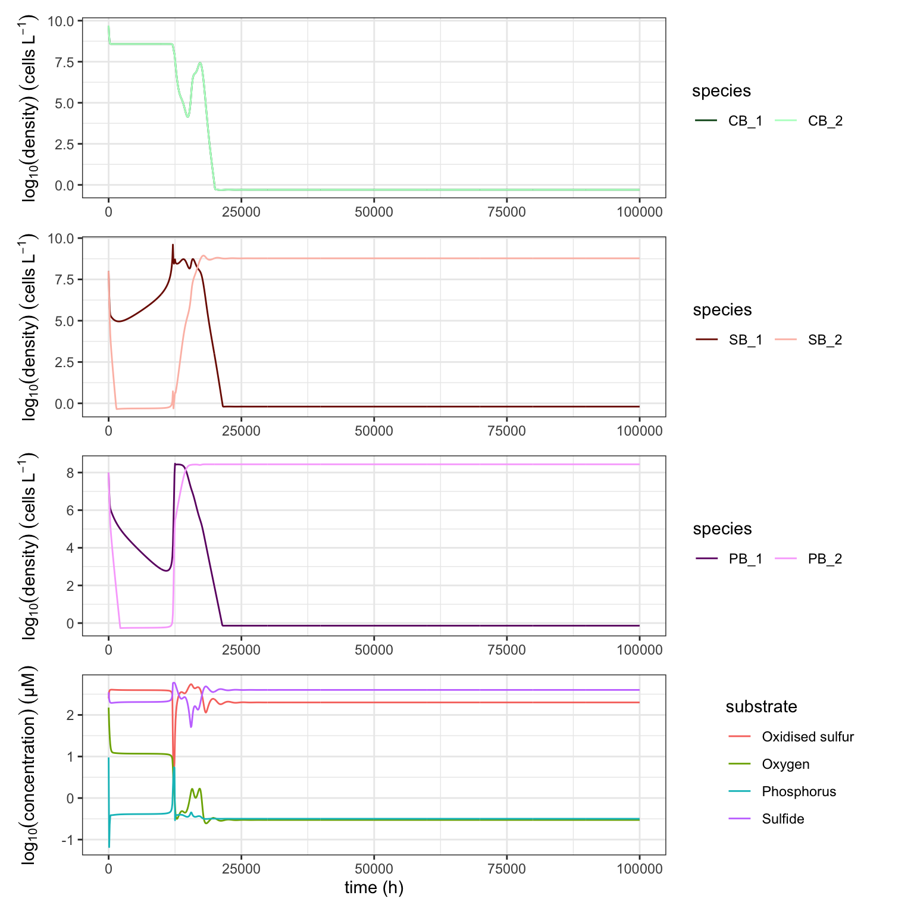

```{r, include = FALSE}
knitr::opts_chunk$set(
  collapse = TRUE,
  comment = "#>"
)
```

```{r setup, include = FALSE}
```

# \textcolor{red}{TODO}
- **\textcolor{red}{update links}**
- **\textcolor{red}{update cross references}**
- **\textcolor{red}{check keywords}**
- **\textcolor{red}{add more references}**
- **\textcolor{red}{expand on Impact and Conclusion section}**
\pagebreak

# Required Metadata
## Current code version
Ancillary data table required for subversion of the codebase.

| **Nr.** | **Code metadata description**                                | **Please fill in this column**                                                 |  
| :-----: | :----------------------------------------------------------- | :----------------------------------------------------------------------------- |  
|   C1    | Current code version                                         | v0.9.0                                                                         |  
|   C2    | Permanent link to code/repository used for this code version | [https://github.com/UZH-PEG/microxanox](https://github.com/UZH-PEG/microxanox) |  
|   C3    | Code Ocean compute capsule                                   |                                                                                |  
|   C4    | Legal Code License                                           | CC BY 4.0                                                                      |  
|   C5    | Code versioning system used                                  | git                                                                            |  
|   C6    | Software code languages, tools, and services used            | [R](https://cran.r-project.org/index.html)                                     |  
|   C7    | Compilation requirements, operating environments             | [R (>= 4.1.0)](https://cran.r-project.org/index.html)                          |  
|         |                                                              | magrittr                                                                       |  
|         |                                                              | tibble                                                                         |  
|         |                                                              | ggplot2                                                                        |  
|         |                                                              | patchwork                                                                      |  
|         |                                                              | grDevices                                                                      |  
|         |                                                              | stats                                                                          |  
|         |                                                              | mgcv                                                                           |  
|         |                                                              | deSolve                                                                        |  
|         |                                                              | dplyr                                                                          |  
|         |                                                              | tidyr                                                                          |  
|         |                                                              | stringr                                                                        |  
|         |                                                              | multidplyr                                                                     |  
|         |                                                              |                                                                                |  
|         |                                                              |                                                                                |  
|         |                                                              |                                                                                |  
|         |                                                              |                                                                                |  
|         |                                                              |                                                                                |  
|   C8    | If available Link to developer documentation/manual          | \textcolor{red}{TO BE ADDED}                                                   |  
|   C9    | Support email for questions                                  | Rainer.Krug@uzh.ch; Rainer@krugs.de                                            |  


# Motivation and significance

Mathematical models play a key role in the development of understanding about how ecosystems work and how they respond to environmental changes [@Binzer2016a; @Chaparro-Pedraza2021; @Vasseur2005]. They are also critical for developing hypotheses that can then be tested in experimental studies. One area of ecology in which simple models have played a very influential role is the area of how ecosystems respond to gradual environmental change [@REF_NEEDED].
- Scheffer, M., Carpenter, S., Foley, J. a, Folke, C. & Walker, B. (2001). Catastrophic shifts in ecosystems. Nature, 413, 591–6.


It is conceivable that an ecosystem state, such as the total biomass of a particular type of bacteria, may remain unchanged when something about its environment changes, such as the temperature. It is possible that the ecosystem state changes gradually itself. It is also possible that the ecosystem state may change abruptly into a new state that is difficult to recover from [@Scheffer2001].

This possibility for abrupt, perhaps catastrophic changes that are difficult to reverse causes considerable concern [@Collins2021; @Northrop2021; @Vandermeer2019].

An example where the gradual change of a single environmental variable is causing an abrupt change of the system is the switch from an aerobic (oxygen is available for metabolism) to anaerobic (oxygen generally unavailable) system. This system has been investigated by @Bush2017 in a simulation study of a mathematical model of the system. They showed that gradual change in the environment could cause catastrophic changes in the ecosystem state that would be difficult to reverse.

One limitation of the study by @Bush2017 was limited biodiversity in the ecosystem model. Specifically, there were three functional groups of bacteria, but within each of these groups, there was no biodiversity. This then leaves open the question of if and how biodiversity within functional groups, in their model, affects the ecosystem response to environmental change. This limitation is not limited to the study of @Bush2017, there are few if any studies of the effects of biodiversity on abrupt transitions between ecosystem states.

We decided to fill this research gap, by making a simulation study of how within functional group biodiversity affects ecosystem responses to environmental change @Limberger2022, and to base our work on the work and model of @Bush2017. It was with this goal in mind that we developed the *microxanox* package. The first stage of development was to write code from scratch (as there was no available code to start from) and to confirm that this new implementation would reproduce the previously published results. The resulting reproduction is available as one of the package vignettes: [vignette Partial reproduction of Bush et al](LINK NEEDED).

The second stage was to add functionality that would be necessary to answer our research question. Most importantly, we made it possible to have multiple species of bacteria within each of the three functional groups, for the multiple species to differ in their characteristics, and to vary the number of species and amount of variability among them. We also added functionality that allowed: temporally varying environmental conditions, addition of random noise to state variables, and immigration. In addition to the model itself, the package includes some functions to analyse the results as well as visualize the results to provide a starting point for customized visualizations based on own requirements. The basic and additional functionality is described in the package [User Guide](LINK_NEEDED).


# Software description
> {>>Describe the software in as much as is necessary to establish a vocabulary needed to explain its impact.<<}

The *microxanox* package is for simulating a three functional group system (*CB*: cyanobacteria, *PB*: phototrophic sulfur bacteria, and *SB*: sulfate-reducing bacteria) with four chemical substrates (*P*: phosphorus, *O*: oxygen, *SR*: reduced sulfur, *SO*: oxidized sulfur). It includes feedback between biogeochemical processes and is based on @Bush2017 (See @Bush2017 for a detailed discussion of the model). At the core of the simulations is a set of ordinary differential equations (specified in the function `bushplus_dynamic_model()`, though users do not need to call this function directly). There are functions for running individual simulations and for running a set of simulations across, for example, a range of environmental conditions.

To make the simulation run with multiple species, we expressed different species characteristics in the elements of vectors and matrices. We also adapted the code for the ordinary differential equations to include the vectors and matrices, and to use matrix mathematics. In this way, we made it possible to run simulations with different numbers of species without having to change the underlying code.

The package functions and code are structured in modular, so that some new functionality can be easily added. E.g. the event definition can easily be changed, or other aspects can be adjusted. All values in the parameter object can be changed as needed and the general structure of the code should make it not to difficult to adapt the model to other similar systems.

## Software architecture
> {>>Give a short overview of the overall software architecture; provide a pictorial component overview or similar (if possible). If necessary provide implementation details.<<}

The framework used when writing this package aimed to maximise simplicity for the user, and to make it easy to reproduce results (see the supplement to @Limberger2022 for an example of how this is used). As such, all the parameters needed to run a simulation or find a stable state are contained in a single object (which can easily be created using included functions). This parameter object is given to a function that runs the simulations and returns the results. The returned results object is identical to the parameter object but with an additional slot named `results`, which contains the results of the run. Thus the returned results object contains the simulation conditions (parameters) as well as the rsults, and can be used to run the simulation again. This promotes reproducibility and makes incremental changes of individual parameters and re-running the simulations straightforward.

In the following sections we describe how to use the package to run one simulation and to find steady states across an environmental gradient.

## Running one simulation

A typical simulation would look as shown in \@ref(fig:runsim_example).

```{R runsim_example, eval = TRUE, echo = FALSE, fig.cap='Typical flow of a simulation. Dark Grey boxes: commands necessary for simulation; Light Grey:Saving of parameter and results; Lightest Grey: Different non specified commands.', fig.align="center", out.width = 350 }
fig <- "./figures/simflow.pdf"

if (!file.exists(fig)){
  library(plantuml)
  puml <- '
    @startuml
    partition "Run Single Simulation" {
      start
      #DarkGrey:\"\"library(microxanox)\"\"\n\"\"parameter <- new_runsim_parameter(...)\"\";
      :Change some parameter
      in the \"\"parameter\"\" object;      
      split
        #LightGrey:\"\"saveRDS(FILE, parameter)\"\";
        detach
      split again
        #DarkGrey:\"\"result <- run_simulation(parameter)\"\";
      end split
      split
        #LightGrey:\"\"saveRDS(FILE, results)\"\";
        detach
      split again
        #DarkGrey:\"\"plot_dynamics(results)\"\";
        :Change some parameter
        in the \"\"result\"\" object;
        #DarkGrey:\"\"result2 <- run_simulation(results)\"\";
      end split
      split
        #LightGrey:\"\"saveRDS(FILE, results2)\"\";
        detach
      split again
        #DarkGrey:\"\"plot_dynamics(results)\"\";
        end
      end split
    }
    @enduml
  '

  plantuml::get_graph(puml, fig)
}

knitr::include_graphics(fig)
```

A simulation is run using the `run_simulation()` function. In this function, the ODEs are solved using the function `ode()` in the package *deSolve* package [@Soetaert2010]. The `run_simulation()` function needs only one argument - an object as created by the function `new_runsim_parameter()`. The parameter object returned by `new_runsim_parameter()` contains among other things the `strain_parameter` object, which can be created by the function `new_strain_parameter()`. For a detailed description of the parameter objects, their meaning and how they are created and have values set and changed please see the *User Guide* which accompanies the package or is available at [User Guide](@LINK_NEEDED)

After the parameter object has been defined, it can be used in the `run_simulation()` function. The function returns an object which is identical to the parameter object, except of an additional slot containing the results. This design produces a fully reproducible object as it can be used as a parameter object to be fed back into the `run_simulation()` function to run the simulation again from the parameter used to generate the results before.


## Finding Steady States

The general approach used to find the stable state of the system with a specific parameter set is to run the simulation for a long time and record the final state. When one does this across a range of environmental conditions, one discovers how the steady state of the system responds to the environmental conditions. The package contains functionality for finding steady states that correspond to values of one environmental variable, namely the value of oxygen diffusivity.

Two methods for finding steady states are implemented. The first runs a separate simulation for each combination of starting conditions and oxygen diffusivity (let us term this the *Replication method*). This is the method used in the @Bush2017 study. The second runs only two simulations, with step-wise and slowly temporally increasing oxygen diffusivity, and the other with step-wise and slowly decreasing or decreasing oxygen diffusivity. During this temporal environmental change, the state of the system was recorded just before change to a new oxygen diffusivity (let us term this the *Temporal method*). We implemented two methods since there is no definitive best method, and in order to check if results were sensitive to choice of method.

The replication method is implementad in the function `run_replication_ssfind()` which takes a parameter object as returned by the function `new_replication_ssfind_parameter()` and the number of cores for multithreading the simulation. As the multithreading uses the package function `mclapply()` from the package `parallel` [@RCoreTeam2022], the multthreading only works on Linux and Mac. It is planned to move to `parLapply()` [@RCoreTeam2022] in a future release.

This temporal method implemented in the function `run_temporal_ssfind()`, which takes a parameter object as created by the function `new_temporal_ssfind_parameter()`. It is planned for a later release, to run these two simulations in parallel.

For a more detailed walk-through of these two approaches and explanation please see the [User Guide](@LINK_NEEDED).

## Visualising and analysing results

From the raw results returned, summary measures about how the ecoystem stable states respond to environmental change can be extracted. The function `get_stability_measures()` returns quantities such as the amount of environmental change required for the system to abruptly change to a different state.

The function `plot_dynamics()` plots a single simulation run, as returned from the `run_simulation()` function. This function is only provided as a convenience function to provide a way to easily see the results of a simulation run. An example plot resulting from this function is shown in \@ref(fig:plot-dynamics).

```{r plot-dynamics, echo = FALSE,  include=TRUE, fig.cap='Plot of results of a simulation run using the function $plot_dynamics()$. Details can be found in the "User Guide" section "Three strains per functional group".', fig.align="center", out.width = 350 }
knitr::include_graphics("figures/ug_three_strains_dynamics.png")
```

# Impact

> {>>This is the main section of the article and the reviewers weight the description here appropriately
Indicate in what way new research questions can be pursued as a result of the software (if any).
Indicate in what way, and to what extent, the pursuit of existing research questions is improved (if so).
Indicate in what way the software has changed the daily practice of its users (if so).
Indicate how widespread the use of the software is within and outside the intended user group.
Indicate in what way the software is used in commercial settings and/or how it led to the creation of spin-off companies (if so).<<}

The free and open source implementation and extension of the model used in @Bush2017 provides the means of reproducing the results published while at the same time provides the means of doing unique, innovative, and important investigations of how ecosystems respond to environmental change. The design of the package code and functionality is with reproducibility in mind: the combination of all parameters being in a single parameter object as well as the return of the simulation as a result object which inherits from the parameter object provides a relatively easy to use framework to implement reproducible experiments.

While the package was not intended to provide a code which can be very easily adapted to other types of ecosystems and types of organism, it seems likely that the overall framework could be used as a basis for models of other ecosystems and organisms. For example, all such models would have parameters that differ among species and need to be described in an object. All would need to run simulations and sets of simulations across environmental conditions. Researchers want to model a new ecosystem do not, therefore, have to start from scratch.  Nevertheless, depending on how different were the new ecosystem to model, the require code changes could be quite significant.

We evidence the impact of the *microxanox* package by describing three use cases, each of which was only possible with the package and that contains new results. The first two use cases are described in detail in the User Guide and the Partial Reproduction Vignettes. The third is taken from @REF_NEEDED for which this R package was designed. All of these use cases can be expanded to larger numbers of strains per functional group and variable values van be changed.

## Use case 1:  Regime shifts during temporal environmental change

The package contains functionality to make a specific pattern of temporal change in the environmental condition oxygen diffusivity; this functionality forms the basis of the temporal method for finding stable states. A simple example of this functionality is given in the Partial Reproduction vignette, which we briefly show here (Figure \@ref(fig:uc1). The example is composed of a single simulation, at the beginning of which the system is in the oxic state with high abundance of cyanobacteria. Oyxgen diffusivity is then slowly decreased and eventually, around hour 30'000 the system switches to the anoxic state, with high abundance of both sulfur bacteria types. The oxygen diffusivity is then quickly increased and at around hour 38'000 the system abruptly switches back to the oxic state.

```{r uc1, echo = FALSE,  include=TRUE, fig.cap='The temporal dynamics of the ecosystem model when an environmental condition (here parameter *a*, the oxygen diffusivity) changes. Plot of the stable states of the simulation runs under different oxygen diffusivity.', fig.align="center", out.width = 350}
fig <- "./figures/gen_uc1_partrep_temporal_state_switching.pdf"
if (!file.exists(fig)){
  library(ggplot2)
  library(microxanox)
  x <- readRDS("./data/hlh_with_defaults.RDS")
  p <- plot_dynamics(x)
  p[[1]] <- p[[1]] + 
    xlab(NULL) + 
    ylab(expression(log[10](density)~(cells~L^{-1}))) +
    theme_bw()
  p[[2]] <- p[[2]] + 
    xlab(NULL) + 
    ylab(expression(log[10](density)~(cells~L^{-1}))) +
    theme_bw()
  p[[3]] <- p[[3]] + 
    xlab(NULL) + 
    ylab(expression(log[10](density)~(cells~L^{-1}))) +
    theme_bw()
  p[[4]]$data <- p[[4]]$data %>% dplyr::filter(species != "a")
  p[[4]]$data$species <- p[[4]]$data$species %>%
    dplyr::recode(SO = "Oxidised sulfur", O = "Oxygen", SR = "Sulfide", P = "Phosphorus")
  p[[4]] <- p[[4]] +
    xlab("time (h)") + 
    ylab(expression(log[10](concentration)~(µM))) + 
    labs(colour = "substrate") +
    theme_bw() +
    xlab(expression(time~(hours)))
  ggsave(
    filename = fig,
    plot = p,
    device = "pdf",
    width = 8,
    height = 8
  )  
}
knitr::include_graphics(fig)
```

## Use case 2: The extent of hysteresis depends on community composition

The package also contains a function to extract summary features of ecosystem responses to environmental change, such as the amount of hysteresis displayed by the ecosystem. Hysteresis is a key feature of ecosystem responses to environmental change, because it is related to how difficult it can be to reserve the effects of environmental change [@Scheffer2001]. The amount of hysteresis was measured here as the extent of the environmental condition for which there were two stable states. I.e. it was the extent of the environmental conditions for which historical conditions play an important role in determining the current system state (a definition of hysteresis). The results show that the amount of hysteresis depends greatly on the combinations of organisms present (Figure \@ref(fig:uc2)). For example, with only the CB (cyanobacteria) present, there was no hysteresis. In contrast, the presence of both CB and SB (sulfate reducing bacteria) led to a large amount of hysteresis. (These results are also given in the Partial Reproduction vignette.)

**@Rainer... the figure needs beautifying please.**
**@Owen: is this OK like this?**

```{r uc2, echo = FALSE,  include=TRUE, fig.cap='The amount of hysteresis depends on the combination of types of organisms present.', fig.align="center", out.width = 350 }
fig <- "./figures/gen_uc2_user_guide_hysteresis.pdf"
if (!file.exists(fig)){
  library(ggplot2)
  x <- readRDS("./data/resp_summ5.rds")
  x$composition <- as.character(x$composition)
  x <- x[order(x$mean_mean_hyst),]
  x$composition <- factor(x$composition, x$composition, ordered = TRUE)
  
 p <- ggplot(x) +
  geom_point(aes(x = composition, y = mean_mean_hyst), shape = 95, size = 25) +
  xlab("Functional groups present") +
  ylab("Amount of hysteresis") +
  #ylim(0,2) +
  theme_light() +
  theme(axis.text.x = element_text(angle = 45, hjust = 1))
  
 ggsave(
   filename = fig,
   plot = p,
   device = "pdf"
 )  

}
knitr::include_graphics(fig)
```

## Use case 3: Effects of functional diversity on regime shifts

As discussed in the Introduction section, the package was largely motivated by the question of how biodiversity influences ecosystem responses to environmental change. Extensive results concerning this question are given in a separate publication @Limberger2022. Here we describe one of the results, which is that having biodiversity in a functional group can allow state changes to occur that otherwise would not have. I.e. biodiversity can qualitatively change the state of the ecosystem.

Biodiversity was added to the functional groups using the `new_strain_parameter()` function to create a parameter set with multiple species per functional group (albeit all with identical features) and then to add variability among the species by calling the `add_strain_var()` function. This function takes an already existing parameter set and adds the specified about of variation. The new parameter object is then used as before.

Figure \@ref(fig:uc3) shows a simulation with two species (strains) in each of the three functional groups. The ecosystem starts in the oxic state, though with relatively high abundance of each functional group. The strain of SB that is more tolerant to oxygen (SB_1) initially decreases in abundance, but then increases, and the other (SB_2) strain then becomes abundance and SB_1 declines. Furthermore, the cyanobacteria crash in abundance, and the system switches to the anoxic state. Importantly, the switch does not occur if there are two identical strains with tolerance half way between those in Figure \@ref(fig:uc3).

**Rainer... please beautify the figure as required. It comes from the Limberger et al supplement, Figure 5.4**
**@Owen: is this OK like this? Used the graph from the supplement**

```{r uc3, echo = FALSE,  include=TRUE, fig.cap='The dynamics of the ecosystem when there are two species in each functional group, and some variation (diversity) in species parameters.', fig.align="center", out.width = 350 }

```


# Conclusions
> {>>Set out the conclusion of this original software publication.<<}

*microxanox* allows the simulation, visualisation, and analysis of a model of a microbial ecosystem while allowing variation in the amount of diversity containing in each of the functional groups of organisms present. It has been used for the research described in another paper of ours that is one of the first investigations of the effects of diversity on ecosystem resilience @Limberger2022. In that paper, we show that diversity can have large and important effects of ecosystem responses, highlighting the need for models such as ours, within which one can easily manipulate the amount of biodiversity. The *microxanox* package has also been used to reproduce the results of the paper that inspired the package development @Bush2017.

The package greatly lowers the amount of work required in further investigations of the specific ecosystem modelled. There has, for example, been quite limited investigation of how biodiversity influences the short-term responses of the modelled ecosystem to environmental change. Likewise, the package could be used to power an investigation of the effects of biodiversity on the usefulness of early warning signals of abrupt ecosystem change [@Scheffer2009]. In addition this package could be used as a template for the implementation for developing models of other types of ecosystems and organism. By doing so, other models can profit from the overall framework used, and the reproducibility aspects as well as the flexibility implemented.


# Conflict of Interest
The authors declare no known conflicting or competing interests associated with this publication and there has been no significant financial support for this work that could have influenced its outcome.

# Acknowledgements
This project was part of SNF Project 310030_188431. The project was also supported by the University of Zurich Research Priority Programme in Global Change and Biodiversity.

# References
